---
tags:
  - comp507
  - assignment
  - part2
  - wbs
  - schedule
---

> [!info] How to use this file
> This is a full working draft of items **15 (WBS, 20 marks)** and **16 (Project Schedule, 20 marks)** for [[Assignment 1_S2_2026.pdf|Part 2]], built from the real facts already locked in from Part 1: the [[Assignment 1 Final|Business Case]] (budget $200,000; planning starts 1 Aug 2025; implementation complete 30 Dec 2025; Wiki live 1 Feb 2026) and the [[Templates/4. Project Charter-final.docx|Project Charter]] (Approach: **Planning → Designing → Review → Feedback collection → Delivery**; team = Matthew Rushmer, Isaiah Thompson, Rahul Shankar, Bradley Ah Sam). It's written to be pasted straight into the Part 2 document, section-by-section, the same way the Part 1 "ready to paste" files were used. Read the callouts as you go — they explain *why* it's built this way so you can defend it if a TA asks, or adapt it if your team's real work diverges.

**Author:** Matthew Rushmer, Isaiah Thompson, Rahul Shankar, Bradley Ah Sam
**Date:** 16/09/2026
**Project Name:** PMS Comparison (Cloud-Based Project Management Software Review — ECMS Wiki)

---

## 15. Work Breakdown Structure (WBS) — 20 marks

### 15.1 Method and rationale

> [!note] Why a phase-based / deliverable-oriented WBS
> The brief asks for "a detailed breakdown of the key phases based on the method you have selected." Rather than invent a new method, this WBS decomposes the **five phases already committed to in the Project Charter's Approach section** — Planning, Designing, Review, Feedback collection, Delivery — into work packages small enough to estimate, assign, and schedule (the 1–2 week size PMBOK calls the "8/80 rule": no work package under ~1 day or over ~2 weeks of effort). This keeps Part 2 consistent with Part 1 instead of contradicting it, which is the first thing a marker will check.
>
> Two things are deliberately **excluded** from the WBS itself, on the grounds that a WBS decomposes *work that produces a deliverable* — not scheduling technique:
> - **Schedule contingency (buffer)** — it's a time reserve, not a work package. It appears in the Project Schedule (§16a) but not here.
> - **Milestones** (Implementation Complete, Wiki Live) — a milestone is a zero-duration point in time, not something anyone "does." They also appear only in §16.

### 15.2 WBS hierarchy

```
0.0 PMS Comparison Wiki Project
├── 1.0 Planning
│   ├── 1.1 Finalise scope statement, quality goals, WBS & schedule baseline sign-off
│   ├── 1.2 Confirm PMS shortlisting criteria with supervisor
│   └── 1.3 Confirm ECMS infrastructure & Wiki workspace access
├── 2.0 Designing — PMS Research & Evaluation
│   ├── 2.1 Market scan of candidate cloud PMS tools (excl. Microsoft Project)
│   ├── 2.2 Apply shortlisting criteria & finalise the two PMS selections
│   ├── 2.3 Benchmark Microsoft Project's feature set to derive comparison criteria
│   ├── 2.4 Research PMS A across all five PM process groups
│   ├── 2.5 Research PMS B across all five PM process groups
│   └── 2.6 Compile source list & APA references
├── 3.0 Designing — Wiki Content Development
│   ├── 3.1 Draft Wiki structure & navigation (by process group and by tool)
│   ├── 3.2 Write Initiating process group comparison
│   ├── 3.3 Write Planning process group comparison
│   ├── 3.4 Write Executing process group comparison
│   ├── 3.5 Write Monitoring/Controlling process group comparison
│   ├── 3.6 Write Closing process group comparison
│   └── 3.7 Compile intro/criteria pages & build out Wiki formatting
├── 4.0 Review & Feedback Collection
│   ├── 4.1 Internal team review (accuracy, citations, quality goals)
│   ├── 4.2 Word-count compliance check & trim to ≤4,500 words
│   ├── 4.3 Supervisor/TA review checkpoint
│   └── 4.4 Recruit & collect sample R&D student feedback
└── 5.0 Delivery
    ├── 5.1 Analyse feedback & revise content
    ├── 5.2 Final proofread, sign-off & publish Wiki to ECMS servers
    ├── 5.3 Announce Wiki to R&D coordinators/students
    ├── 5.4 Handover documentation to ECMS IT
    └── 5.5 Milestone report (v2), lessons-learned report & project closure meeting
```

25 work packages across 5 phases. Every leaf item is small enough for one team member (or a clear pair) to own, and produces a checkable output — which is what the marker means by "outline of all the key activities."

### 15.3 WBS Dictionary

> [!tip] Why include a dictionary
> A bare hierarchy tells a marker *what* the work is called but not what "done" looks like or who's accountable. The dictionary is what turns a nice-looking tree into something that could actually be run — and it's the table §16a's schedule baseline is built directly from, so the two deliverables stay consistent with each other instead of drifting apart (a common way marks get lost across #15/#16).

| WBS # | Work Package | Deliverable / "Done" looks like | Owner |
|---|---|---|---|
| 1.1 | Finalise scope statement, quality goals, WBS & schedule baseline sign-off | Signed-off scope statement (#14) with quality goals stated; this WBS and schedule approved by the team | Whole team, led by Matthew |
| 1.2 | Confirm PMS shortlisting criteria with supervisor | Supervisor-agreed written criteria for shortlisting candidate PMS tools | Matthew |
| 1.3 | Confirm ECMS infrastructure & Wiki workspace access | Confirmed lab/remote access to the Wiki platform for all 4 members | Rahul |
| 2.1 | Market scan of candidate cloud PMS tools | Longlist of ≥5 candidate SaaS PMS tools (Microsoft Project excluded) | Isaiah |
| 2.2 | Apply shortlisting criteria & finalise 2 PMS selection | Final 2 PMS named, with the criteria-based rationale documented | Whole team, decision led by Matthew |
| 2.3 | Benchmark Microsoft Project feature set | One-page feature map of MS Project across the 5 process groups, used to derive comparison criteria (never listed as a selectable option) | Bradley |
| 2.4 | Research PMS A across 5 process groups | Sourced notes on PMS A's Initiating/Planning/Executing/Monitoring-Controlling/Closing features | Isaiah & Rahul |
| 2.5 | Research PMS B across 5 process groups | Sourced notes on PMS B's Initiating/Planning/Executing/Monitoring-Controlling/Closing features | Matthew & Bradley |
| 2.6 | Compile source list & APA references | De-duplicated reference list in APA format, ready to cite in-text | Rahul |
| 3.1 | Draft Wiki structure & navigation | Page map / nav tree agreed by the team before writing starts | Matthew |
| 3.2 | Write Initiating comparison | Drafted, cited Initiating page comparing PMS A vs B | Matthew |
| 3.3 | Write Planning comparison | Drafted, cited Planning page comparing PMS A vs B | Isaiah |
| 3.4 | Write Executing comparison | Drafted, cited Executing page comparing PMS A vs B | Rahul |
| 3.5 | Write Monitoring/Controlling comparison | Drafted, cited Monitoring/Controlling page comparing PMS A vs B | Bradley |
| 3.6 | Write Closing comparison | Drafted, cited Closing page comparing PMS A vs B | Matthew |
| 3.7 | Compile intro/criteria pages & build Wiki formatting | All 5 process-group pages plus intro/criteria pages live in the Wiki platform, formatted consistently | Whole team, led by Matthew |
| 4.1 | Internal team review | Every page checked against the quality goals in the scope statement | Whole team |
| 4.2 | Word-count compliance check & trim | Total Wiki content ≤4,500 words, confirmed by an explicit count | Bradley |
| 4.3 | Supervisor/TA review checkpoint | Written supervisor feedback received | Matthew |
| 4.4 | Recruit & collect sample R&D student feedback | Feedback captured from a small sample of current/former R&D students | Rahul |
| 5.1 | Analyse feedback & revise content | Revision log showing what changed in response to supervisor + student feedback | Whole team |
| 5.2 | Final proofread, sign-off & publish | Wiki live on ECMS servers | Matthew & Bradley |
| 5.3 | Announce Wiki to R&D coordinators/students | Announcement sent/circulated | Rahul |
| 5.4 | Handover documentation to ECMS IT | Short handover note covering hosting, edit access, maintenance | Isaiah |
| 5.5 | Milestone report v2, lessons-learned report & closure | Both documents complete (#19, #20); closure meeting held | Bradley (reports), whole team (closure meeting) |

---

## 16. Project Schedule — 20 marks

### 16a. Schedule baseline

> [!note] Duration unit and the two fixed milestones
> Durations are given in **weeks**, not days — this is a part-time student team working around other papers, not a team with 5 dedicated person-days a week per task, so day-level granularity would overstate precision without being any more realistic. The schedule is anchored to the two **fixed dates already committed to in the Business Case**: Implementation Complete by **30 December 2025** and Wiki Live by **1 February 2026**. It also books in the AUT summer closure (teams don't work over the break) as real non-working time rather than pretending the team works through it — that's what "realistic" means for this criterion, and it's also what creates the interesting critical-path discussion in §16c.

**Week 1 begins Monday 4 August 2025** (the Monday after the Business Case's 1 Aug 2025 planning start).

| WBS # | Work Package | Duration | Predecessor(s) | Planned Start | Planned Finish | Float |
|---|---|---|---|---|---|---|
| 1.1 | Finalise scope, quality goals, WBS & schedule sign-off | 1 wk | — | Mon 04 Aug 2025 | Sun 10 Aug 2025 | 0 |
| 1.2 | Confirm PMS shortlisting criteria with supervisor | 1 wk | 1.1 | Mon 11 Aug 2025 | Sun 17 Aug 2025 | 0 |
| 1.3 | Confirm ECMS infrastructure & Wiki workspace access | 1 wk | 1.1 | Mon 11 Aug 2025 | Sun 17 Aug 2025 | 5 wks |
| 2.1 | Market scan of candidate cloud PMS tools | 2 wks | 1.2 | Mon 18 Aug 2025 | Sun 31 Aug 2025 | 0 |
| 2.2 | Apply criteria & finalise 2 PMS selection | 1 wk | 2.1 | Mon 01 Sep 2025 | Sun 07 Sep 2025 | 0 |
| 2.3 | Benchmark MS Project feature set | 2 wks | 1.2 | Mon 18 Aug 2025 | Sun 31 Aug 2025 | 1 wk |
| 2.4 | Research PMS A across 5 process groups | 3 wks | 2.2, 2.3 | Mon 08 Sep 2025 | Sun 28 Sep 2025 | 0 |
| 2.5 | Research PMS B across 5 process groups | 3 wks | 2.2, 2.3 | Mon 08 Sep 2025 | Sun 28 Sep 2025 | 0 |
| 2.6 | Compile source list & APA references | 1 wk | 2.4, 2.5 | Mon 29 Sep 2025 | Sun 05 Oct 2025 | 1 wk |
| 3.1 | Draft Wiki structure & navigation | 1 wk | 2.2, 1.3 | Mon 08 Sep 2025 | Sun 14 Sep 2025 | 2 wks |
| 3.2 | Write Initiating comparison | 2 wks | 2.4, 2.5, 3.1 | Mon 29 Sep 2025 | Sun 12 Oct 2025 | 0 |
| 3.3 | Write Planning comparison | 2 wks | 2.4, 2.5, 3.1 | Mon 29 Sep 2025 | Sun 12 Oct 2025 | 0 |
| 3.4 | Write Executing comparison | 2 wks | 2.4, 2.5, 3.1 | Mon 29 Sep 2025 | Sun 12 Oct 2025 | 0 |
| 3.5 | Write Monitoring/Controlling comparison | 2 wks | 2.4, 2.5, 3.1 | Mon 29 Sep 2025 | Sun 12 Oct 2025 | 0 |
| 3.6 | Write Closing comparison | 2 wks | 2.4, 2.5, 3.1 | Mon 29 Sep 2025 | Sun 12 Oct 2025 | 0 |
| 3.7 | Compile intro/criteria pages & build Wiki formatting | 2 wks | 3.2–3.6, 2.6 | Mon 13 Oct 2025 | Sun 26 Oct 2025 | 0 |
| 4.1 | Internal team review | 1 wk | 3.7 | Mon 27 Oct 2025 | Sun 02 Nov 2025 | 0 |
| 4.2 | Word-count check & trim to ≤4,500 words | 1 wk | 4.1 | Mon 03 Nov 2025 | Sun 09 Nov 2025 | 0 |
| 4.3 | Supervisor/TA review checkpoint | 1 wk | 4.2 | Mon 10 Nov 2025 | Sun 16 Nov 2025 | 1 wk |
| 4.4 | Recruit & collect student feedback | 2 wks | 4.2 | Mon 10 Nov 2025 | Sun 23 Nov 2025 | 0 |
| **BUF** | **Schedule contingency / buffer** | 5 wks | 4.3, 4.4 | Mon 24 Nov 2025 | Sun 28 Dec 2025 | 0 |
| **M1** | **Milestone — Implementation Complete** | — | BUF | — | **~28 Dec 2025** (baselined **30 Dec 2025** per brief) | — |
| *(closure)* | *AUT summer closure — non-working* | 3 wks | — | Mon 29 Dec 2025 | Sun 18 Jan 2026 | — |
| 5.1 | Analyse feedback & revise content | 1 wk | BUF | Mon 19 Jan 2026 | Sun 25 Jan 2026 | 0 |
| 5.2 | Final proofread, sign-off & publish Wiki | 1 wk | 5.1 | Mon 26 Jan 2026 | Sun 01 Feb 2026 | 0 |
| **M2** | **Milestone — Wiki Live (go-live)** | — | 5.2 | — | **1 Feb 2026** | — |
| 5.3 | Announce Wiki to R&D coordinators/students | 1 wk | 5.2 | Mon 02 Feb 2026 | Sun 08 Feb 2026 | 0 |
| 5.4 | Handover documentation to ECMS IT | 1 wk | 5.2 | Mon 02 Feb 2026 | Sun 08 Feb 2026 | 0 |
| 5.5 | Milestone report v2, lessons-learned & closure | 1 wk | 5.3, 5.4 | Mon 09 Feb 2026 | Sun 15 Feb 2026 | 0 |

**Total schedule span:** 4 Aug 2025 – 15 Feb 2026 (~28 weeks), made up of 25 working weeks of team effort, a 5-week contingency buffer, and the 3-week AUT closure.

### 16b. Network diagram

> [!note] Reading this diagram
> This is an **Activity-on-Node (AON)** diagram — each box is a work package, arrows show dependency, and boxes running side-by-side (e.g. 2.4/2.5, or 3.2–3.6) can happen concurrently because different people own them. Red boxes are the **critical path**: zero float, so a delay to any one of them delays the whole project by the same amount. Gold hexagons are the two brief-mandated milestones.

```mermaid
flowchart LR
    classDef crit fill:#ffd6d6,stroke:#c0392b,stroke-width:2px,color:#000
    classDef float fill:#eef3fb,stroke:#5b7fa6,stroke-width:1px,color:#000
    classDef milestone fill:#fff3c4,stroke:#b8860b,stroke-width:2px,color:#000

    A11["1.1 Finalise scope &<br/>baseline sign-off · 1wk"]:::crit
    A12["1.2 Confirm PMS<br/>criteria · 1wk"]:::crit
    A13["1.3 Confirm infrastructure<br/>access · 1wk"]:::float
    A21["2.1 Market scan<br/>· 2wks"]:::crit
    A22["2.2 Finalise 2 PMS<br/>selection · 1wk"]:::crit
    A23["2.3 Benchmark MS<br/>Project · 2wks"]:::float
    A24["2.4 Research<br/>PMS A · 3wks"]:::crit
    A25["2.5 Research<br/>PMS B · 3wks"]:::crit
    A26["2.6 Compile<br/>references · 1wk"]:::float
    A31["3.1 Draft Wiki<br/>structure · 1wk"]:::float
    A32["3.2 Write Initiating<br/>· 2wks"]:::crit
    A33["3.3 Write Planning<br/>· 2wks"]:::crit
    A34["3.4 Write Executing<br/>· 2wks"]:::crit
    A35["3.5 Write Mon/Ctrl<br/>· 2wks"]:::crit
    A36["3.6 Write Closing<br/>· 2wks"]:::crit
    A37["3.7 Compile & build<br/>Wiki · 2wks"]:::crit
    A41["4.1 Internal<br/>review · 1wk"]:::crit
    A42["4.2 Word-count<br/>check · 1wk"]:::crit
    A43["4.3 Supervisor<br/>review · 1wk"]:::float
    A44["4.4 Student<br/>feedback · 2wks"]:::crit
    BUF["BUF Schedule<br/>contingency · 5wks"]:::crit
    M1{{"M1 · Implementation<br/>Complete · 30 Dec 2025"}}:::milestone
    A51["5.1 Analyse feedback<br/>& revise · 1wk"]:::crit
    A52["5.2 Proofread, sign-off<br/>& publish · 1wk"]:::crit
    M2{{"M2 · Wiki Live<br/>1 Feb 2026"}}:::milestone
    A53["5.3 Announce to<br/>R&D students · 1wk"]:::crit
    A54["5.4 Handover to<br/>ECMS IT · 1wk"]:::crit
    A55["5.5 Milestone report v2,<br/>lessons-learned, closure · 1wk"]:::crit

    A11 --> A12
    A11 --> A13
    A12 --> A21
    A12 --> A23
    A21 --> A22
    A22 --> A24
    A23 --> A24
    A22 --> A25
    A23 --> A25
    A22 --> A31
    A13 --> A31
    A24 --> A26
    A25 --> A26
    A24 --> A32
    A25 --> A32
    A31 --> A32
    A24 --> A33
    A25 --> A33
    A31 --> A33
    A24 --> A34
    A25 --> A34
    A31 --> A34
    A24 --> A35
    A25 --> A35
    A31 --> A35
    A24 --> A36
    A25 --> A36
    A31 --> A36
    A26 --> A37
    A32 --> A37
    A33 --> A37
    A34 --> A37
    A35 --> A37
    A36 --> A37
    A37 --> A41
    A41 --> A42
    A42 --> A43
    A42 --> A44
    A43 --> BUF
    A44 --> BUF
    BUF --> M1
    M1 --> A51
    A51 --> A52
    A52 --> M2
    M2 --> A53
    M2 --> A54
    A53 --> A55
    A54 --> A55
```



### 16c. Critical path analysis

**Project duration:** 25 working weeks of team effort (28 calendar weeks including the 5-week contingency buffer and the 3-week AUT closure), running from **Monday 4 August 2025** to **Sunday 15 February 2026**, with the Wiki live milestone landing on **1 February 2026** — exactly the date the Business Case committed to.

**The critical path** (zero float throughout):

> 1.1 → 1.2 → 2.1 → 2.2 → 2.4 → 2.5 → 3.2 → 3.3 → 3.4 → 3.5 → 3.6 → 3.7 → 4.1 → 4.2 → 4.4 → BUF → 5.1 → 5.2 → 5.3 / 5.4 → 5.5

21 of the 25 work packages sit on this path — a reminder that in a mostly-sequential, small-team project, "critical" doesn't mean rare. Only four packages carry float:

| WBS # | Float | What the float means in practice |
|---|---|---|
| 1.3 Confirm infrastructure access | 5 wks | Can slip almost the whole planning phase without touching the schedule — low-risk, can be delegated and checked on later |
| 2.3 Benchmark MS Project | 1 wk | One week of slack; useful buffer if the person doing it is also on 2.1 |
| 2.6 Compile references | 1 wk | Can finish up to a week after 2.4/2.5 without delaying 3.7 |
| 3.1 Draft Wiki structure | 2 wks | Most slack of the "designing" packages — can be revisited/refined while research is still running |
| 4.3 Supervisor review | 1 wk | If the supervisor is slow to respond, one week is absorbed before it threatens the buffer |

**Required timing of the critical activities:** because float is zero along the whole chain above, each of those 21 packages has a single valid start/finish window — the "Planned Start"/"Planned Finish" columns in §16a *are* the early-start/early-finish and late-start/late-finish dates simultaneously. There's no room to start any of them later than shown without pushing every downstream date back by the same amount.

**Where the schedule actually has room — and where it doesn't:**

- The **5-week contingency buffer (BUF)** is the only true slack in the whole project, and it's deliberately placed *before* Implementation Complete rather than scattered across individual tasks. That means:
  - A slip **anywhere in phases 1–4** (1.1 through 4.4) eats into the 5-week buffer first. E.g. if PMS vendor pricing changes mid-research and 2.4/2.5 run 1 week over, Implementation Complete still lands on time (30 Dec 2025) — it's just that only 4 weeks of buffer remain, not 5.
  - If cumulative delays across phases 1–4 exceed 5 weeks, the buffer is fully consumed and **Implementation Complete itself slips past 30 Dec 2025** — the first date the project would actually miss.
- **Once the team resumes after the AUT closure (19 Jan 2026), there is no float left anywhere.** 5.1 and 5.2 sit on a hard, unbuffered 2-week countdown to the go-live milestone. A one-week delay to *either* of them — a slow round of feedback revisions, a publishing hiccup — pushes **Wiki Live past 1 February 2026**, which is the date the whole project exists to hit (R&D teams need the Wiki before Semester 1, 2026 begins). This is the single highest-risk point in the schedule and the one worth flagging explicitly to the supervisor.
- 5.3 and 5.4 run in parallel after go-live (announcing the Wiki and handing over documentation to ECMS IT don't depend on each other), so neither creates a secondary bottleneck — but 5.5 can't start until *both* finish, so a delay to either one still delays project closure.

**Practical takeaway for the team:** protect the buffer during phases 1–4 (don't let early research or writing slip "because there's time later" — there isn't, once the closure hits), and treat everything from 19 January onward as a fixed-date sprint with zero room to absorb surprises.

---

## Sources

- Project facts (budget, dates, team, approach): [[Assignment 1 Final|Business Case & Project Charter, Part 1]]
- Brief requirements for #15/#16: [[Assignment 1_S2_2026.pdf]], p.4
- WBS/CPM method: standard PMBOK-aligned Work Breakdown Structure and Critical Path Method (forward/backward pass), as covered in the COMP507 Schedule Management lecture material
